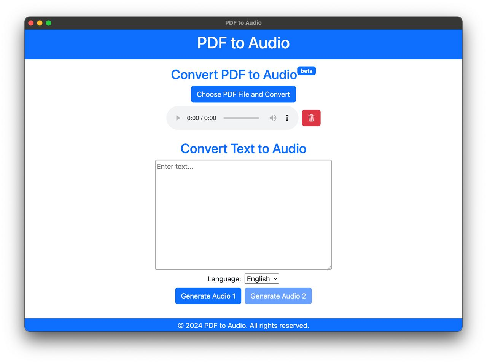

# 🔊 PDF to Audio+


> Simple and fast PDF and text to Audio converter written in Electron.



---

## 🔑 Key Features

- **PDF** to **Audio** conversion
- **Text** to **Audio** conversion

## 🙏 Donations

**PDF to Audio+** is a free, open source software developed in my (little) spare time. If you liked the project and would like to support further development, please consider making a small donation, it really helps :)

<a href="https://www.buymeacoffee.com/albertarakelyan" target="_blank"></a>

## 🏰 Architecture

### Tech Stack

<div>


</div>

## ⬇️ Download
You can download the app from the **Releases** at the right or from our [website](https://albertarakelyan.com).

---

## 📦 Installation
_Note: Make sure you are using correct `node` and `yarn` versions._

### Versions
- node: `20.18.0`
- npm: `10.2.3`

### Repo
- Clone the repo
```bash
git clone https://github.com/AlbertArakelyan/pdf-to-audio-plus.git
```

### Development
- Install dependencies
```bash
npm install
```
- Run development environment
```bash
npm run dev
```

## 🏗️ Building
For building binary you need to following commands depending on the environment.
- For Mac
```bash
electron-builder --mac
```
- For Windows
```bash
electron-builder --win
```

---

Feeling lucky? Give it a star ⭐ and fork for adding something from your side 😊.

Made with ❤️ by [Albert Arakelyan](https://github.com/AlbertArakelyan) <br>
https://www.albertarakelyan.com
